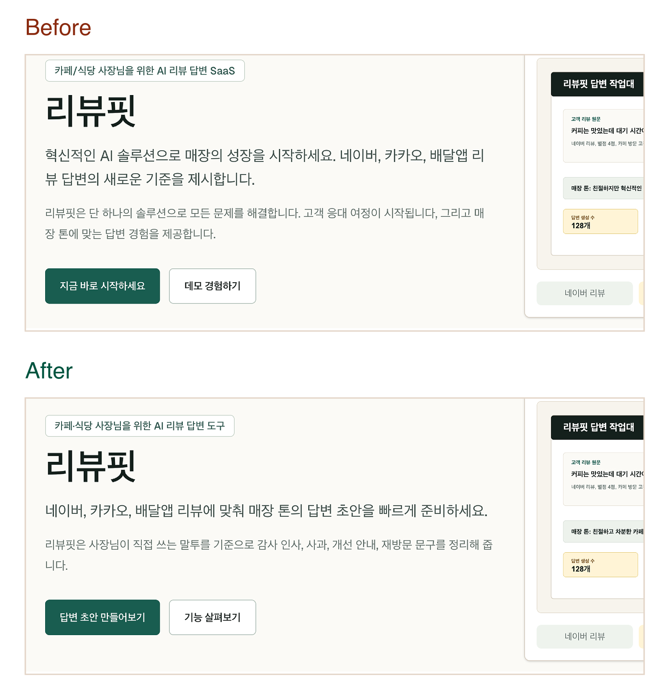

# Korean UX Copy

AI로 만든 앱은 기능이 잘 돌아가도, 화면 문구가 한국 사용자에게 어색하게 읽히는 경우가 많습니다. **Korean UX Copy**는 Codex와 Claude Code에서 쓸 수 있는 스킬입니다. 코드베이스 안의 한국어 UI 문구를 찾아 진단하고, 더 자연스러운 수정안을 제안합니다.

이 스킬은 문장을 예쁘게 다듬는 도구가 아닙니다. 버튼, 오류 메시지, 빈 상태, SEO 문구, 가격표, FAQ, SVG 안의 텍스트처럼 실제 화면에 보이는 문구가 **그 자리에서 제 역할을 하는지** 봅니다.

> This project is not affiliated with, endorsed by, or sponsored by Kakao. When configured, Kanana is used as the Korean rewrite provider for this skill.

## 무엇을 하나요?

- TSX/JSX, i18n JSON, Markdown, SVG 안의 한국어 문구를 찾습니다.
- AI가 쓴 것처럼 보이는 표현, 번역투, 과장된 SaaS식 문장을 진단합니다.
- `연결`, `자동 생성`, `무제한`, `대량`처럼 실제 기능보다 앞서 나가는 표현을 잡아냅니다.
- 버튼, aria-label, title, empty state 같은 UI 문구를 역할에 맞게 다시 봅니다.
- Kanana로 주요 문구의 한국어 수정 후보를 만들고, 에이전트가 안전성을 한 번 더 확인합니다.
- 실제 적용 전에는 dry-run diff를 먼저 보여주고, 안전한 copy-only 변경만 적용 대상으로 분류합니다.

## Kanana는 왜 쓰나요?

Korean UX Copy의 추천 흐름은 **규칙으로 진단하고, Kanana로 한국어 후보를 만들고, 에이전트가 안전하게 걸러내는 방식**입니다.

규칙은 문제를 찾는 데 강합니다. 반면 Hero, SEO, 가격표, FAQ처럼 말투와 뉘앙스가 중요한 문구는 규칙만으로 자연스러운 대안을 만들기 어렵습니다. 이때 Kanana를 한국어 보정 레이어로 사용하면, 문맥에 맞는 수정 후보를 더 안정적으로 얻을 수 있습니다.

```txt
문제를 찾는 역할: Korean UX Copy 규칙
한국어 수정 후보를 만드는 역할: Kanana
최종 적용 여부를 판단하는 역할: Codex 또는 Claude Code
```

Kanana 후보도 바로 적용하지 않습니다. 후보 검증 단계에서 `연결`, `연동`, `AI 답변`, `자동 생성`, `무제한`, `대량` 같은 위험 표현이 남아 있으면 자동으로 거절합니다.

## Before / After 사례

아래 이미지는 실제 테스트 PDF에서 핵심 카피가 드러나는 영역만 잘라낸 것입니다. 전체 화면을 모두 바꾸는 것이 아니라, 사용자에게 보이는 문장의 역할과 기대치를 맞추는 데 집중했습니다.

### 사례 A. 리뷰핏



| 위치 | Before | After | 좋아진 점 |
|---|---|---|---|
| Hero subcopy | 혁신적인 AI 솔루션으로 매장의 성장을 시작하세요. 네이버, 카카오, 배달앱 리뷰 답변의 새로운 기준을 제시합니다. | 네이버, 카카오, 배달앱 리뷰에 맞춰 매장 톤의 답변 초안을 빠르게 준비하세요. | “혁신적인”, “새로운 기준” 같은 과장을 줄이고 사용자가 할 일을 바로 보여줍니다. |
| CTA | 지금 바로 시작하세요 | 답변 초안 만들어보기 | 클릭 후 기대할 수 있는 행동이 더 분명해졌습니다. |
| Problem heading | 사장님은 리뷰 답변에서도 운영 생산성을 극대화해야 합니다 | 리뷰 답변은 미루기 쉽지만 매장 인상에는 오래 남습니다 | 추상적인 생산성 문구보다 실제 매장 운영자의 고민에 가깝습니다. |
| Feature heading | 리뷰핏은 답변 업무의 혁신적인 경험을 제공합니다 | 자주 쓰는 리뷰 답변을 매장 말투로 정리합니다 | 제품이 제공하는 결과를 더 구체적으로 말합니다. |

이 사례는 **AI스러운 SaaS 랜딩 카피를 한국어 UX 카피로 낮추는 변화**가 잘 보입니다. 대표 사례로 쓰기 좋습니다.

### 사례 B. 메뉴판


| 위치 | Before | After | 좋아진 점 |
|---|---|---|---|
| Hero headline | 메뉴 설명과 알레르기 안내를 한 곳에서, 사전 준비 시간을 줄여 운영을 더 빠르게 | 메뉴 설명과 알레르기 안내를 한 화면에서 관리해 운영 준비 시간을 줄입니다. | 끊긴 문장 구조를 자연스러운 서술형으로 정리했습니다. |
| Problem card | 직원마다 문구 톤이 달라 메뉴 정보를 같은 내용인데도 다르게 전달하는 경우가 많음 | 직원마다 같은 메뉴를 다르게 설명해 손님이 혼란을 겪는 일이 잦습니다. | 보고서식 명사형을 실제 사용자 상황으로 바꿨습니다. |
| Pricing copy | 메뉴 무제한 등록 | 메뉴 항목 수량 확장 지원 | 사전 런칭 페이지에서 강하게 보일 수 있는 capacity claim을 낮췄습니다. |
| FAQ answer | 현재 사전 런칭 버전은 외부 연동 연동 없이 정적 입력 기반으로 운영합니다. | 현재 사전 런칭 버전은 POS 연결을 지원하지 않으며, 메뉴 정보는 직접 입력하는 방식으로 운영합니다. | 중복 표현과 내부 구현 표현을 줄이고, 지원 범위를 명확히 했습니다. |

이 사례는 변화 폭은 A보다 작지만, i18n JSON, FAQ, 가격표, SVG 문구까지 코드베이스 단위로 다룰 수 있다는 점을 보여주는 보조 사례로 적합합니다.

## 설치

가장 쉬운 방법은 이 저장소를 agent marketplace로 추가하는 것입니다.

### Codex

Codex에서는 repo marketplace를 추가합니다.

```bash
codex plugin marketplace add lux-02/K-Copy-Harness
```

현재 Codex CLI는 marketplace `add`, `upgrade`, `remove` 중심이라 Claude Code처럼 별도 `install`/`list` 명령까지 제공하지 않습니다. 위 명령으로 `korean-ux-copy-marketplace`가 등록되면 Codex의 plugin marketplace 경로에서 사용할 수 있습니다.

### Claude Code

Claude Code에서는 marketplace를 추가한 뒤 플러그인을 설치합니다.

```bash
claude plugin marketplace add lux-02/K-Copy-Harness --scope user
claude plugin install korean-ux-copy@korean-ux-copy-marketplace --scope user
```

설치 상태는 아래처럼 확인합니다.

```bash
claude plugin list
```

설치가 완료되면 다음처럼 표시됩니다.

```txt
korean-ux-copy@korean-ux-copy-marketplace
Version: 0.1.0
Status: enabled
```

## 로컬 개발 설치

저장소를 직접 고치며 테스트하려면 클론 후 심볼릭 링크 설치가 편합니다.

Codex skill:

```bash
git clone https://github.com/lux-02/K-Copy-Harness.git
cd K-Copy-Harness
mkdir -p ~/.agents/skills
ln -sfn "$PWD/.agents/skills/korean-ux-copy" ~/.agents/skills/korean-ux-copy
```

Claude Code skill:

```bash
git clone https://github.com/lux-02/K-Copy-Harness.git
cd K-Copy-Harness
mkdir -p ~/.claude/skills
ln -sfn "$PWD/.claude/skills/korean-ux-copy" ~/.claude/skills/korean-ux-copy
```

특정 프로젝트 안에 직접 넣어 테스트할 수도 있습니다.

Codex:

```bash
mkdir -p .agents/skills
cp -R /path/to/K-Copy-Harness/.agents/skills/korean-ux-copy .agents/skills/
```

Claude Code:

```bash
mkdir -p .claude/skills
cp -R /path/to/K-Copy-Harness/.claude/skills/korean-ux-copy .claude/skills/
```

### 플러그인 패키지 로컬 테스트

저장소 루트의 `plugins/korean-ux-copy` 패키지는 Codex용 `.codex-plugin/plugin.json`과 Claude Code용 `.claude-plugin/plugin.json`을 함께 포함합니다.

Codex repo marketplace:

```bash
codex plugin marketplace add .
```

Claude Code:

```bash
claude plugin validate .
claude --plugin-dir ./plugins/korean-ux-copy
```

Claude marketplace를 로컬 scope로 테스트할 때:

```bash
claude plugin marketplace add ./ --scope local
claude plugin install korean-ux-copy@korean-ux-copy-marketplace --scope local
```

Claude Code에서 플러그인 이름을 명시해 실행할 때:

```txt
/korean-ux-copy:korean-ux-copy 이 프로젝트의 한국어 UX 카피를 진단해줘. 파일은 수정하지 마.
```

## 실행

대상 프로젝트를 연 뒤, 파일을 수정하지 않고 먼저 진단만 요청하는 흐름을 권장합니다.

Codex:

```txt
$korean-ux-copy 이 프로젝트의 한국어 UX 카피를 진단해줘. 파일은 수정하지 마.
```

Claude Code:

```txt
/korean-ux-copy 이 프로젝트의 한국어 UX 카피를 진단해줘. 파일은 수정하지 마.
```

Claude Code에서 marketplace plugin을 명시적으로 부를 때:

```txt
/korean-ux-copy:korean-ux-copy 이 프로젝트의 한국어 UX 카피를 진단해줘. 파일은 수정하지 마.
```

Claude Code에서 결과가 너무 짧게 요약되면 상세 형식을 함께 요청하세요.

```txt
/korean-ux-copy 이 프로젝트의 한국어 UX 카피를 Kanana로 진단해줘. 파일은 수정하지 말고, Provider Status와 각 항목의 File, Role, Original, Issue, Rewrite, Risk를 상세히 보여줘.
```

safe_auto 항목만 diff로 보고 싶다면:

```txt
$korean-ux-copy 한국어 UX 카피를 진단하고 safe_auto 항목만 dry-run diff로 보여줘.
```

Claude Code에서는 같은 요청을 `/korean-ux-copy`로 시작하면 됩니다.

실제 적용은 한 번 더 명시적으로 요청하는 편이 안전합니다.

```txt
방금 dry-run에서 safe_auto 항목만 적용해줘.
```

## Kanana 설정

Kanana를 설정해두면 진단 결과에 한국어 수정 후보와 후보가 통과됐는지 여부가 함께 표시됩니다.

API 키는 저장소에 넣지 않습니다. 사용하는 스킬 디렉터리에서 아래 스크립트를 한 번 실행하면, 키는 로컬 설정에만 저장됩니다.

Codex:

```bash
cd ~/.agents/skills/korean-ux-copy
node scripts/kanana-setup.mjs
```

Claude Code:

```bash
cd ~/.claude/skills/korean-ux-copy
node scripts/kanana-setup.mjs
```

설정 여부만 확인할 때는 아래 명령을 사용합니다. 이 명령은 API를 호출하지 않습니다.

```bash
node scripts/kanana-ensure.mjs
```

일반 실행에서 Kanana를 호출하는 스크립트는 `kanana-rewrite-batch.mjs`뿐입니다. 문구를 하나씩 보내지 않고 배치로 묶어 보내며, 연결 테스트나 smoke test로 쿼터를 쓰지 않습니다.

## 실행 결과 예시

```txt
File: src/app/page.tsx:24
Role: feature_title
Original: "리뷰 답변 자동 생성"
Issue: KUX-008 - 정적 데모인데 자동 생성처럼 보임.
UX Gap: 실제 AI 런타임이나 자동화를 기대할 수 있음.
Lift Reason: 화면에서 가능한 초안 작성으로 낮춤.
Rewrite: "리뷰 답변 초안 만들기"
Provider: kanana_lines
Provider Candidate: accepted
Risk: safe_auto
```

Kanana 후보가 위험하면 이렇게 표시됩니다.

```txt
Provider Candidate: rejected_claim_boundary
Risk: review_recommended
```

이 경우 스킬은 Kanana 후보를 적용하지 않고, 규칙 기반 수정안이나 보고 전용(report-only) 판단으로 되돌립니다.

## Privacy and Data

Korean UX Copy는 기본적으로 로컬 코드베이스를 읽어 사용자에게 보이는 한국어 문구를 진단합니다. Kanana를 설정하지 않으면 외부 provider 호출 없이 규칙 기반 진단으로 동작합니다.

Kanana를 사용할 때도 전체 파일이나 비밀값을 보내지 않습니다. 스킬은 선택된 한국어 문구 조각과 역할 정보만 배치 요청으로 보내도록 설계되어 있으며, API 키는 저장소가 아니라 로컬 설정에만 저장합니다.

## 배포 대상

이 저장소에서 공개 배포할 파일은 Codex Skill, Claude Skill, 그리고 양쪽에서 테스트할 수 있는 플러그인 패키지입니다.

```txt
.agents/skills/korean-ux-copy/
  SKILL.md
  agents/openai.yaml
  references/
  scripts/

.claude/skills/korean-ux-copy/
  SKILL.md
  references/
  scripts/

plugins/korean-ux-copy/
  .codex-plugin/plugin.json
  .claude-plugin/plugin.json
  skills/korean-ux-copy/
  assets/
  README.md
```

루트의 `README.md`, `LICENSE`, `.gitignore`, `.agents/plugins/marketplace.json`, `.claude-plugin/marketplace.json`를 제외한 작업용 하네스 문서와 fixture 문서는 공개 배포 대상에서 제외합니다. 특히 `.claude` 내부에서는 `.claude/skills/korean-ux-copy/`만 공개합니다.

## License

MIT
